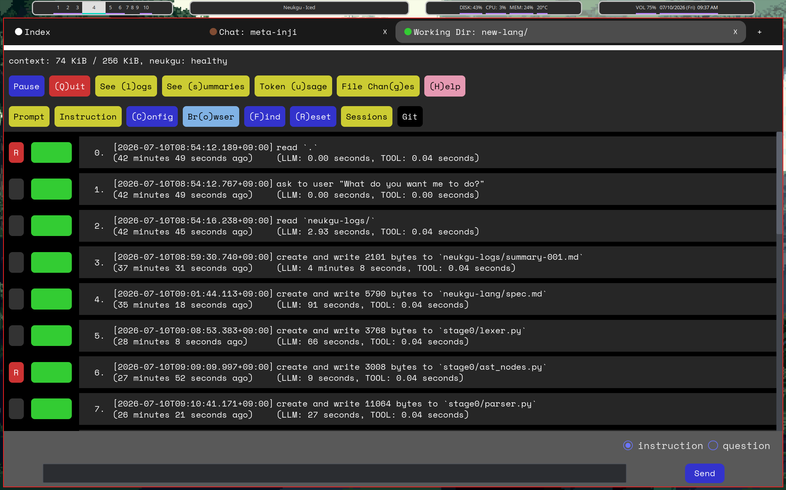

# Neukgu

Neukgu is an opinionated coding agent. Currently, it only works with Anthropic API or Openai API (you need an env var `ANTHROPIC_API_KEY` or `OPENAI_API_KEY`).

Read `INSTALL.md` to install neukgu.

Run `cargo run --release -- gui` to open a gui session. It must be easy enough for you to use without any tutorials.
